# BAKERY BAKING SCHEDULE ALGORITHM
## Complete Technical Documentation

**Version:** 1.0  
**Date:** October 2025  
**Document Type:** Algorithm Specification & Implementation Guide

---

## TABLE OF CONTENTS

1. [Executive Summary](#executive-summary)
2. [Business Requirements](#business-requirements)
3. [System Overview](#system-overview)
4. [Data Structure](#data-structure)
5. [Algorithm Logic](#algorithm-logic)
6. [Machine Learning Component](#machine-learning-component)
7. [Special Cases](#special-cases)
8. [Output Specifications](#output-specifications)
9. [Performance Metrics](#performance-metrics)
10. [Implementation Notes](#implementation-notes)

---

## 1. EXECUTIVE SUMMARY

This document describes an intelligent algorithm for automated baking schedule planning in grocery stores with frozen bakery products. The system:

- **Generates plans for 3 daily baking waves** (morning, midday, evening)
- **Minimizes waste** while ensuring product availability
- **Learns from historical data** using machine learning
- **Adapts in real-time** based on actual sales performance
- **Optimizes tray allocation** for efficient oven usage

**Key Benefits:**
- Reduced waste (target: <5% for non-key products)
- Improved product availability (fewer stock-outs)
- Automated decision-making with manual override capability
- Continuous learning and improvement

---

## 2. BUSINESS REQUIREMENTS

### 2.1 Store Operations
- **Store Hours:** 7:00 AM - 8:00 PM
- **Product Range:** ~30 SKUs (frozen bakery products)
- **Oven Capacity:** 2-3 trays per oven
- **Baking Time:** ~15 minutes per batch
- **Staff:** Single operator per shift

### 2.2 Baking Waves
1. **Wave 1:** Generated ~6:30 AM → Covers 7:00-15:00
2. **Wave 2:** Generated ~12:30 PM → Covers 15:00-18:00
3. **Wave 3:** Generated ~14:30 PM → Covers 18:00-19:00

### 2.3 Business Goals
- **Before 6:00 PM:** Maximize availability (buffer planning)
- **After 6:00 PM:** Minimize waste (conservative planning)
- **Key Products:** 2 bestselling SKUs can have 3-5 rolls/1 bread waste
- **Other Products:** Waste minimization is critical

---

## 3. SYSTEM OVERVIEW

### 3.1 Algorithm Flow Diagram (Mermaid)

Below is the complete Mermaid diagram code. You can paste it into https://mermaid.live/ to view or into any Markdown renderer that supports Mermaid.

```mermaid
graph TD
    Start([START: Generate Plan]) --> CheckWave{Which Wave?}
    
    CheckWave -->|Wave 1| Wave1[WAVE 1: Plan for 7:00-15:00]
    CheckWave -->|Wave 2| Wave2[WAVE 2: Plan for 15:00-18:00]
    CheckWave -->|Wave 3| Wave3[WAVE 3: Plan for 18:00-19:00]
    
    Wave1 --> LoadData1[Load Historical Data]
    LoadData1 --> CheckHoliday{Holiday?}
    
    CheckHoliday -->|Yes| HolidayLogic[Increase Weight:<br/>Year-over-year<br/>same day type]
    CheckHoliday -->|No| NormalLogic[Standard Weights]
    
    HolidayLogic --> CollectHistData
    NormalLogic --> CollectHistData[Collect Data for Each SKU]
    
    CollectHistData --> DataSources[Data Sources:<br/>1. Same weekday 1-4 months ago<br/>2. Last 4-8 weeks<br/>3. Same day of month 3-4 months<br/>4. Year-over-year<br/>5. Historical waste]
    
    DataSources --> CheckNewProduct{New Product?}
    CheckNewProduct -->|Yes| UseTemplate[Use Similar<br/>Product Data]
    CheckNewProduct -->|No| CheckSeasonality{Seasonal Product?}
    
    UseTemplate --> CheckSeasonality
    CheckSeasonality -->|Yes| ApplySeason[Apply Seasonality Curve<br/>Year-over-year]
    CheckSeasonality -->|No| CalculateWeights
    
    ApplySeason --> CalculateWeights[Calculate Weights<br/>Machine Learning]
    
    CalculateWeights --> DetectGaps[Detect Stock-outs<br/>in History]
    
    DetectGaps --> AdjustGaps{Stock-outs Found?}
    AdjustGaps -->|Yes| IncreaseBase[Increase Base Forecast<br/>Treat Drops as<br/>Unmet Demand]
    AdjustGaps -->|No| SmoothAnomalies
    
    IncreaseBase --> SmoothAnomalies[Smooth Anomalies<br/>Deviation >30%]
    
    SmoothAnomalies --> CalcBaseF1[Calculate Base Forecast<br/>Sales 7:00-15:00]
    
    CalcBaseF1 --> HourlyDist1[Hourly Distribution<br/>Based on History]
    
    HourlyDist1 --> ApplyBuffer1{Key Product?}
    ApplyBuffer1 -->|Yes| BufferKey1[Dynamic Buffer<br/>Higher for Bestsellers]
    ApplyBuffer1 -->|No| BufferNormal1[Dynamic Buffer<br/>Standard]
    
    BufferKey1 --> FinalF1[WAVE 1 PLAN]
    BufferNormal1 --> FinalF1
    
    FinalF1 --> GroupByProgram1[Group by Baking<br/>Programs]
    GroupByProgram1 --> SortBestSeller1[Sort: Bestsellers<br/>→ Slow-movers]
    SortBestSeller1 --> OptimizeTrays1[Optimize<br/>Tray Placement]
    OptimizeTrays1 --> Output1[OUTPUT: Wave 1 Plan]
    
    Wave2 --> LoadRealData2[Load Actual Sales<br/>7:00-12:30]
    LoadRealData2 --> CompareF1[Compare with Wave 1<br/>Forecast]
    
    CompareF1 --> CalcDeviation2{Deviation?}
    CalcDeviation2 -->|>+20%| IncreaseModerate[Increase Cautiously +15%<br/>Remember Potential Stock-out]
    CalcDeviation2 -->|-20% to +20%| KeepPlan2[Continue Per Plan]
    CalcDeviation2 -->|<-20%| DecreasePlan2[Decrease Plan<br/>Product Selling Slower]
    
    IncreaseModerate --> DetectGapF1{Stock-out Detected<br/>End of Wave 1?}
    DetectGapF1 -->|Yes| IncreaseAggressive[Increase Aggressively<br/>Product Ran Out]
    DetectGapF1 -->|No| CalcBaseF2
    
    KeepPlan2 --> CalcBaseF2[Calculate Forecast<br/>15:00-18:00]
    DecreasePlan2 --> CalcBaseF2
    IncreaseAggressive --> CalcBaseF2
    
    CalcBaseF2 --> HourlyDist2[Hourly Distribution<br/>15:00-18:00]
    HourlyDist2 --> ApplyBuffer2[Dynamic Buffer<br/>Medium Level]
    ApplyBuffer2 --> FinalF2[WAVE 2 PLAN]
    
    FinalF2 --> GroupByProgram2[Group by Programs]
    GroupByProgram2 --> SortBestSeller2[Sort Bestsellers]
    SortBestSeller2 --> OptimizeTrays2[Optimize Trays]
    OptimizeTrays2 --> Output2[OUTPUT: Wave 2 Plan]
    
    Wave3 --> LoadRealData3[Load Sales<br/>7:00-14:30]
    LoadRealData3 --> CompareF1F2[Compare with<br/>Wave 1 & 2 Forecasts]
    
    CompareF1F2 --> CalcRemaining[Calculate Remaining<br/>Forecast 18:00-19:00]
    
    CalcRemaining --> CheckSalesRate{Sales Rate?}
    CheckSalesRate -->|Very Slow| ZeroPlan3[Plan = 0<br/>Minimize Waste]
    CheckSalesRate -->|Slow| MinimalPlan3[Minimal Plan<br/>Ultra-Conservative]
    CheckSalesRate -->|Normal/Fast| ConservativePlan3[Conservative Plan<br/>No Buffer]
    
    ZeroPlan3 --> FinalF3[WAVE 3 PLAN]
    MinimalPlan3 --> FinalF3
    ConservativePlan3 --> FinalF3
    
    FinalF3 --> GroupByProgram3[Group by Programs]
    GroupByProgram3 --> SortBestSeller3[Sort Bestsellers]
    SortBestSeller3 --> OptimizeTrays3[Optimize Trays]
    OptimizeTrays3 --> Output3[OUTPUT: Wave 3 Plan]
    
    Output1 --> Display
    Output2 --> Display
    Output3 --> Display
    
    Display[Display Plan in Table<br/>with Tray Grouping]
    Display --> ManualAdjust{Manager Adjusts?}
    
    ManualAdjust -->|Yes| SaveCorrection[Save Correction<br/>for Learning]
    ManualAdjust -->|No| Confirm
    
    SaveCorrection --> Confirm[Confirm Execution<br/>Per Product]
    
    Confirm --> EndOfDay[End of Day:<br/>Collect Waste & Sales]
    
    EndOfDay --> Evaluate[Evaluate Effectiveness:<br/>- Forecast Accuracy<br/>- % Waste<br/>- Detected Stock-outs]
    
    Evaluate --> UpdateWeights[Update Weights<br/>Loss Function: waste > stock-outs]
    
    UpdateWeights --> WeeklyUpdate{End of Week?}
    WeeklyUpdate -->|Yes| Reoptimize[Re-optimize Weights<br/>Entire Algorithm]
    WeeklyUpdate -->|No| End
    
    Reoptimize --> End([END])
    
    style Start fill:#e1f5e1
    style End fill:#ffe1e1
    style Output1 fill:#fff4e1
    style Output2 fill:#fff4e1
    style Output3 fill:#fff4e1
    style FinalF1 fill:#e1f0ff
    style FinalF2 fill:#e1f0ff
    style FinalF3 fill:#e1f0ff
```



### 3.2 Data Flow

```
Historical Data → Data Preparation → Forecasting → Wave Planning → Tray Optimization → Output
                                          ↓
                                    Real-time Sales Data → Adjustment → Next Wave
                                          ↓
                                    End of Day Evaluation → Learning
```

### 3.3 Key Components

1. **Data Collection Module**
   - Hourly sales tracking per SKU
   - Daily waste recording
   - Plan execution confirmation

2. **Forecasting Engine**
   - Multi-source data aggregation
   - ML weight optimization
   - Stock-out detection
   - Anomaly smoothing

3. **Wave Planning Module**
   - Base forecast calculation
   - Dynamic buffer application
   - Real-time adaptation (Waves 2-3)

4. **Tray Optimization**
   - Grouping by baking program
   - Priority-based sorting
   - Space optimization

5. **Learning System**
   - Weekly weight updates
   - Manager correction incorporation
   - Performance evaluation

---

## 4. DATA STRUCTURE

### 4.1 Product Master Data

```json
{
  "sku_id": "001",
  "product_name": "Kaiser Roll",
  "category": "rolls",
  "baking_program": "P1",
  "baking_time_minutes": 15,
  "pieces_per_tray": 30,
  "is_key_product": true,
  "similar_product_id": null,
  "date_introduced": "2023-01-15",
  "status": "active"
}
```

### 4.2 Historical Sales Data

```json
{
  "date": "2025-10-15",
  "hour": 10,
  "sku_id": "001",
  "quantity_sold": 12,
  "timestamp": "2025-10-15T10:00:00Z"
}
```

### 4.3 Daily Waste Data

```json
{
  "date": "2025-10-15",
  "sku_id": "001",
  "quantity_wasted": 3,
  "reason": "end_of_day"
}
```

### 4.4 Plan Execution Data

```json
{
  "date": "2025-10-15",
  "wave": 1,
  "sku_id": "001",
  "planned_quantity": 50,
  "executed": true,
  "manager_adjustment": 0,
  "adjustment_reason": null
}
```

### 4.5 Special Events

```json
{
  "date": "2025-12-24",
  "event_type": "holiday",
  "event_name": "Christmas Eve",
  "impact_level": "high"
}
```

---

## 5. ALGORITHM LOGIC

### 5.1 Data Preparation Module

#### 5.1.1 Data Sources & Weights

The algorithm aggregates data from multiple sources with learned weights:

| Data Source | Lookback Period | Initial Weight | Learning |
|------------|-----------------|----------------|----------|
| Same weekday (1 month ago) | 4 weeks | 35% | Yes |
| Same weekday (2 months ago) | 8 weeks | 25% | Yes |
| Last week average | 1 week | 20% | Yes |
| Same day of month | 3-4 months | 10% | Yes |
| Year-over-year | 12 months | 10% | Yes |

**Base Forecast Formula:**
```
base_forecast = Σ(weight[i] × sales_data[i])
where i = data source index
```

#### 5.1.2 Stock-out Detection Algorithm

```python
def detect_stockout(hourly_sales, hour):
    """
    Detects if a stock-out occurred by analyzing sales patterns
    """
    avg_sales_this_hour = get_average_sales(hour, last_4_weeks)
    previous_hour_sales = hourly_sales[hour - 1]
    current_hour_sales = hourly_sales[hour]
    
    # Stock-out likely if:
    # 1. Sales drop significantly below average
    # 2. Previous hour had normal/high sales
    if (current_hour_sales < 0.3 * avg_sales_this_hour and 
        previous_hour_sales >= 0.8 * avg_sales_this_hour):
        return True
    
    # Check for multi-hour zero sales (definite stock-out)
    if sum(hourly_sales[hour:hour+2]) == 0 and avg_sales_this_hour > 2:
        return True
    
    return False
```

#### 5.1.3 Anomaly Smoothing

```python
def smooth_anomalies(sales_data, threshold=0.3):
    """
    Remove anomalies that deviate >30% from median
    """
    median = calculate_median(sales_data)
    smoothed_data = []
    
    for value in sales_data:
        deviation = abs(value - median) / median
        if deviation > threshold:
            smoothed_data.append(median)  # Replace with median
        else:
            smoothed_data.append(value)
    
    # Apply 3-day moving average
    return moving_average(smoothed_data, window=3)
```

---

### 5.2 WAVE 1 - Morning Planning

**Generated:** ~6:30 AM  
**Coverage:** 7:00 AM - 3:00 PM  
**Strategy:** Aggressive with buffer

#### Algorithm Steps:

**Step 1: Calculate Base Forecast**
```python
def calculate_wave1_forecast(sku_id, date):
    # Get weighted historical data
    data_sources = {
        'same_weekday_4w': get_sales(sku_id, same_weekday(date, -4)),
        'same_weekday_8w': get_sales(sku_id, same_weekday(date, -8)),
        'last_week_avg': get_avg_sales(sku_id, last_7_days(date)),
        'same_day_month': get_sales(sku_id, same_day_of_month(date, -1)),
        'year_over_year': get_sales(sku_id, same_date(date, -365))
    }
    
    # Apply learned weights
    weights = get_current_weights(sku_id)
    base_forecast = sum(weights[k] * data_sources[k] for k in data_sources)
    
    return base_forecast
```

**Step 2: Detect Historical Stock-outs**
```python
def adjust_for_stockouts(base_forecast, sku_id, date):
    historical_stockouts = detect_historical_stockouts(sku_id, last_4_weeks(date))
    
    if historical_stockouts > 0:
        # Increase forecast by 15-25% based on frequency
        stockout_factor = 1 + (0.15 + 0.1 * min(historical_stockouts / 4, 1))
        return base_forecast * stockout_factor
    
    return base_forecast
```

**Step 3: Apply Hourly Distribution**
```python
def distribute_hourly(total_forecast, sku_id):
    # Get typical hourly pattern for this product
    hourly_pattern = get_hourly_pattern(sku_id)
    
    # For Wave 1: hours 7-15 (8 hours)
    wave1_hours = hourly_pattern[7:15]
    wave1_percentage = sum(wave1_hours) / sum(hourly_pattern)
    
    return total_forecast * wave1_percentage
```

**Step 4: Apply Dynamic Buffer**
```python
def calculate_buffer(sku_id, base_forecast):
    product = get_product_info(sku_id)
    historical_waste = get_avg_waste(sku_id, last_4_weeks)
    historical_stockouts = count_stockouts(sku_id, last_4_weeks)
    
    # Base buffer by product type
    if product['is_key_product']:
        base_buffer = 0.25  # 25% for bestsellers
    elif product['sales_velocity'] == 'high':
        base_buffer = 0.15  # 15% for fast movers
    else:
        base_buffer = 0.08  # 8% for slow movers
    
    # Adjust based on history
    waste_factor = max(0.5, 1 - historical_waste / base_forecast)
    stockout_factor = 1 + (historical_stockouts * 0.05)
    
    final_buffer = base_buffer * waste_factor * stockout_factor
    
    return base_forecast * (1 + final_buffer)
```

**Step 5: Generate Wave 1 Plan**
```python
def generate_wave1_plan(date):
    plan = {}
    
    for sku_id in get_active_skus():
        base = calculate_wave1_forecast(sku_id, date)
        adjusted = adjust_for_stockouts(base, sku_id, date)
        wave1_amount = distribute_hourly(adjusted, sku_id)
        final_amount = calculate_buffer(sku_id, wave1_amount)
        
        plan[sku_id] = {
            'quantity': round(final_amount),
            'base_forecast': round(base),
            'buffer_applied': round(final_amount - wave1_amount)
        }
    
    return plan
```

---

### 5.3 WAVE 2 - Midday Planning

**Generated:** ~12:30 PM  
**Coverage:** 3:00 PM - 6:00 PM  
**Strategy:** Adaptive based on morning performance

#### Algorithm Steps:

**Step 1: Analyze Morning Performance**
```python
def analyze_wave1_performance(sku_id, date):
    planned = get_planned_quantity(sku_id, date, wave=1)
    actual_sales = get_actual_sales(sku_id, date, hours=[7, 12.5])
    
    # Calculate deviation
    deviation = (actual_sales / planned) - 1
    
    # Check for stock-out in morning
    stockout_detected = detect_stockout_in_period(
        sku_id, date, hours=[7, 12.5]
    )
    
    return {
        'deviation': deviation,
        'stockout': stockout_detected,
        'actual_sales': actual_sales,
        'planned': planned
    }
```

**Step 2: Calculate Adjustment Factor**
```python
def calculate_wave2_adjustment(performance):
    deviation = performance['deviation']
    
    if deviation > 0.20:  # Sales 20%+ higher than planned
        if performance['stockout']:
            # Aggressive increase - we ran out
            return 1.35  # +35%
        else:
            # Cautious increase - just selling well
            return 1.15  # +15%
    
    elif -0.20 <= deviation <= 0.20:
        # On track
        return 1.0
    
    else:  # deviation < -0.20
        # Selling slower than expected
        return 0.85  # -15%
```

**Step 3: Generate Wave 2 Plan**
```python
def generate_wave2_plan(date):
    plan = {}
    
    for sku_id in get_active_skus():
        # Get base afternoon forecast
        base_afternoon = calculate_afternoon_forecast(sku_id, date)
        
        # Analyze morning performance
        performance = analyze_wave1_performance(sku_id, date)
        adjustment = calculate_wave2_adjustment(performance)
        
        # Apply adjustment
        adjusted_forecast = base_afternoon * adjustment
        
        # Medium buffer for Wave 2
        buffer = 0.10 if not performance['stockout'] else 0.15
        final_amount = adjusted_forecast * (1 + buffer)
        
        # Remember if we detected stock-out for learning
        if performance['stockout']:
            log_stockout_event(sku_id, date, wave=1)
        
        plan[sku_id] = {
            'quantity': round(final_amount),
            'adjustment_factor': adjustment,
            'morning_performance': performance
        }
    
    return plan
```

---

### 5.4 WAVE 3 - Evening Planning

**Generated:** ~2:30 PM  
**Coverage:** 6:00 PM - 7:00 PM  
**Strategy:** Ultra-conservative, minimize waste

#### Algorithm Steps:

**Step 1: Analyze Full Day Performance**
```python
def analyze_full_day_performance(sku_id, date):
    # Get all sales until 2:30 PM
    total_sales = get_actual_sales(sku_id, date, hours=[7, 14.5])
    
    # Get typical daily pattern
    typical_pattern = get_hourly_pattern(sku_id)
    
    # Calculate sales rate
    hours_elapsed = 7.5  # 7:00 AM to 2:30 PM
    current_rate = total_sales / hours_elapsed
    
    # Compare to typical rate for this time
    typical_rate_by_now = get_typical_sales_by_hour(sku_id, 14.5) / 7.5
    
    rate_ratio = current_rate / typical_rate_by_now if typical_rate_by_now > 0 else 0
    
    return {
        'total_sales': total_sales,
        'sales_rate': current_rate,
        'rate_ratio': rate_ratio
    }
```

**Step 2: Calculate Conservative Evening Forecast**
```python
def generate_wave3_plan(date):
    plan = {}
    
    for sku_id in get_active_skus():
        product = get_product_info(sku_id)
        performance = analyze_full_day_performance(sku_id, date)
        
        # Base evening forecast (6-7 PM, 1 hour)
        base_evening = calculate_evening_forecast(sku_id, date)
        
        # Adjust based on day performance
        if performance['rate_ratio'] < 0.5:
            # Very slow day - don't bake
            final_amount = 0
        
        elif performance['rate_ratio'] < 0.8:
            # Slow day - minimal plan
            final_amount = base_evening * 0.4
        
        else:
            # Normal/fast day - conservative plan
            final_amount = base_evening * 0.8
        
        # Exception for key products - always minimum
        if product['is_key_product'] and final_amount < 5:
            final_amount = 5
        
        # NO BUFFER for Wave 3
        plan[sku_id] = {
            'quantity': round(final_amount),
            'rate_ratio': performance['rate_ratio'],
            'strategy': 'minimize_waste'
        }
    
    return plan
```

---

### 5.5 Tray Optimization Algorithm

```python
def optimize_tray_allocation(wave_plan, wave_number):
    """
    Groups products by baking program and optimizes tray allocation
    """
    # Step 1: Group by baking program
    programs = {}
    for sku_id, plan_data in wave_plan.items():
        product = get_product_info(sku_id)
        program = product['baking_program']
        
        if program not in programs:
            programs[program] = []
        
        programs[program].append({
            'sku_id': sku_id,
            'quantity': plan_data['quantity'],
            'pieces_per_tray': product['pieces_per_tray'],
            'priority': calculate_priority(sku_id)
        })
    
    # Step 2: Sort within each program by priority
    for program in programs:
        programs[program].sort(key=lambda x: x['priority'], reverse=True)
    
    # Step 3: Allocate to trays
    tray_allocation = []
    tray_number = 1
    
    for program, products in programs.items():
        current_tray = {
            'tray_number': tray_number,
            'program': program,
            'products': [],
            'total_pieces': 0
        }
        
        for product in products:
            if product['quantity'] > 0:
                current_tray['products'].append({
                    'sku_id': product['sku_id'],
                    'product_name': get_product_info(product['sku_id'])['product_name'],
                    'quantity': product['quantity']
                })
                current_tray['total_pieces'] += product['quantity']
        
        if current_tray['products']:
            tray_allocation.append(current_tray)
            tray_number += 1
    
    return tray_allocation

def calculate_priority(sku_id):
    """
    Calculate product priority for baking order
    """
    sales_velocity = get_sales_velocity(sku_id, last_30_days)
    stockout_count = count_stockouts(sku_id, last_4_weeks)
    is_key = get_product_info(sku_id)['is_key_product']
    
    priority = sales_velocity * 100
    priority += stockout_count * 50
    priority += 1000 if is_key else 0
    
    return priority
```

---

## 6. MACHINE LEARNING COMPONENT

### 6.1 Loss Function

The algorithm optimizes weights to minimize total loss, where waste is penalized more heavily than stock-outs:

```python
def calculate_loss(predictions, actuals, waste, stockouts):
    """
    Multi-objective loss function
    """
    # Forecast accuracy loss
    forecast_loss = sum((pred - actual)**2 for pred, actual in zip(predictions, actuals))
    
    # Waste loss (higher weight - 2.0)
    waste_loss = 2.0 * sum(w**2 for w in waste)
    
    # Stock-out loss (medium weight - 1.0)
    stockout_loss = 1.0 * sum(s**2 for s in stockouts)
    
    # Total loss
    total_loss = forecast_loss * 0.5 + waste_loss + stockout_loss
    
    return total_loss
```

### 6.2 Weight Optimization

Weights are updated weekly using gradient descent:

```python
def update_weights_weekly():
    """
    Weekly weight optimization across all products
    """
    for sku_id in get_active_skus():
        # Collect week's performance data
        week_data = get_week_performance(sku_id)
        
        # Calculate gradients
        gradients = calculate_gradients(
            current_weights=get_current_weights(sku_id),
            performance_data=week_data
        )
        
        # Update weights using gradient descent
        learning_rate = 0.01
        current_weights = get_current_weights(sku_id)
        
        for source in current_weights:
            current_weights[source] -= learning_rate * gradients[source]
        
        # Normalize weights to sum to 1.0
        total = sum(current_weights.values())
        for source in current_weights:
            current_weights[source] /= total
        
        # Save updated weights
        save_weights(sku_id, current_weights)
        
        # Log performance
        log_weight_update(sku_id, current_weights, week_data)
```

### 6.3 Learning from Manager Corrections

```python
def learn_from_correction(sku_id, date, wave, planned, adjusted, reason):
    """
    Incorporate manager manual adjustments into learning
    """
    correction_factor = adjusted / planned
    
    # Extract context
    context = {
        'day_of_week': date.weekday(),
        'is_holiday': is_holiday(date),
        'weather': get_weather(date),
        'recent_trend': get_sales_trend(sku_id, last_7_days(date))
    }
    
    # Store correction with context
    store_correction(sku_id, date, wave, correction_factor, context, reason)
    
    # If similar context occurs, apply learned correction
    similar_corrections = find_similar_corrections(sku_id, context)
    
    if len(similar_corrections) >= 3:
        # Create correction rule
        avg_correction = average([c['correction_factor'] for c in similar_corrections])
        create_correction_rule(sku_id, context, avg_correction)
```

---

## 7. SPECIAL CASES

### 7.1 Holiday Handling

```python
def adjust_for_holiday(date, sku_id):
    """
    Special handling for holidays
    """
    if not is_holiday(date):
        return get_standard_weights(sku_id)
    
    # Increase weight for year-over-year same holiday
    holiday_weights = {
        'same_weekday_4w': 0.10,  # Reduced
        'same_weekday_8w': 0.10,  # Reduced
        'last_week_avg': 0.05,    # Reduced
        'same_day_month': 0.05,   # Reduced
        'year_over_year_holiday': 0.70  # INCREASED - primary source
    }
    
    # Get sales from same holiday last year
    last_year_holiday = get_same_holiday_last_year(date)
    holiday_sales = get_sales(sku_id, last_year_holiday)
    
    # Treat stock-outs in last year's data as unmet demand
    if detect_stockout(holiday_sales):
        holiday_sales = estimate_unmet_demand(holiday_sales)
    
    return holiday_weights, holiday_sales
```

### 7.2 New Product Launch

```python
def handle_new_product(sku_id, weeks_since_launch):
    """
    Special handling for new products without history
    """
    product = get_product_info(sku_id)
    similar_product = product['similar_product_id']
    
    if weeks_since_launch < 2:
        # First 2 weeks: very conservative, use similar product
        base_plan = get_avg_sales(similar_product, last_4_weeks) * 0.5
        return base_plan
    
    elif weeks_since_launch < 4:
        # Weeks 3-4: blend own data with similar product
        own_data = get_avg_sales(sku_id, last_2_weeks)
        similar_data = get_avg_sales(similar_product, last_4_weeks)
        return own_data * 0.6 + similar_data * 0.4
    
    else:
        # After 4 weeks: transition to normal algorithm
        return None  # Use standard algorithm
```

### 7.3 Product Phase-Out Detection

```python
def detect_phase_out(sku_id):
    """
    Detect products that may be discontinued
    """
    recent_sales = get_sales(sku_id, last_14_days)
    
    # No sales for 2+ weeks
    if sum(recent_sales) == 0:
        send_alert(
            message=f"Product {sku_id} has zero sales for 14 days. Remove from planning?",
            type="phase_out_detection"
        )
        return True
    
    # Consistent declining trend
    trend = calculate_trend(sku_id, last_8_weeks)
    if trend < -0.3:  # 30% decline
        send_alert(
            message=f"Product {sku_id} shows 30% declining trend. Review product status?",
            type="declining_sales"
        )
    
    return False
```

### 7.4 Seasonality Handling

```python
def apply_seasonality_curve(sku_id, date):
    """
    Apply learned seasonality patterns
    """
    # Calculate seasonality index from year-over-year data
    month = date.month
    week_of_year = date.isocalendar()[1]
    
    # Get sales for this week from last year
    same_week_last_year = get_sales(sku_id, same_week(date, -52))
    
    # Get annual average
    annual_avg = get_annual_avg_sales(sku_id)
    
    # Calculate seasonality index
    if annual_avg > 0:
        seasonality_index = same_week_last_year / annual_avg
    else:
        seasonality_index = 1.0
    
    return seasonality_index
```

---

## 8. OUTPUT SPECIFICATIONS

### 8.1 Main Planning Table

| Column | Description | Format |
|--------|-------------|--------|
| SKU | Product ID | String (3-10 chars) |
| Product Name | Display name | String |
| Program | Baking program code | String (P1, P2, etc.) |
| Wave 1 (pcs) | Morning quantity | Integer |
| Wave 2 (pcs) | Midday quantity | Integer |
| Wave 3 (pcs) | Evening quantity | Integer |
| Notes | Alerts/flags | String |

**Example:**
```
┌─────┬─────────────────┬─────────┬──────────┬──────────┬──────────┬──────────────────┐
│ SKU │ Product Name    │ Program │ Wave 1   │ Wave 2   │ Wave 3   │ Notes            │
├─────┼─────────────────┼─────────┼──────────┼──────────┼──────────┼──────────────────┤
│ 001 │ Kaiser Roll     │ P1      │ 50       │ 20       │ 10       │ Bestseller       │
│ 002 │ Wheat Bread     │ P2      │ 30       │ 15       │ 5        │                  │
│ 003 │ Croissant       │ P3      │ 25       │ 10       │ 0        │ Slow sales today │
└─────┴─────────────────┴─────────┴──────────┴──────────┴──────────┴──────────────────┘
```

### 8.2 Tray Allocation View

```
═══════════════════════════════════════════════════════════════
WAVE 1 - START AT 6:30 AM
═══════════════════════════════════════════════════════════════

TRAY 1 (Program P1 - 15 minutes)
  ├─ Kaiser Rolls: 50 pcs
  ├─ Wheat Buns: 30 pcs
  └─ Total: 80 pcs

TRAY 2 (Program P1 - 15 minutes)
  ├─ Whole Grain Rolls: 25 pcs
  ├─ Sesame Buns: 20 pcs
  └─ Total: 45 pcs

TRAY 3 (Program P2 - 18 minutes)
  ├─ Wheat Bread: 30 pcs
  ├─ Rye Bread: 20 pcs
  └─ Total: 50 pcs

───────────────────────────────────────────────────────────────
Total Wave 1: 175 pieces across 3 trays
Estimated time: ~45 minutes
───────────────────────────────────────────────────────────────
```

### 8.3 API Response Format

```json
{
  "date": "2025-10-16",
  "wave": 1,
  "generated_at": "2025-10-16T06:30:00Z",
  "products": [
    {
      "sku_id": "001",
      "product_name": "Kaiser Roll",
      "baking_program": "P1",
      "planned_quantity": 50,
      "base_forecast": 45,
      "buffer_applied": 5,
      "notes": "Bestseller - key product",
      "confidence": 0.87
    }
  ],
  "tray_allocation": [
    {
      "tray_number": 1,
      "baking_program": "P1",
      "baking_time_minutes": 15,
      "products": [
        {"sku_id": "001", "quantity": 50},
        {"sku_id": "002", "quantity": 30}
      ],
      "total_pieces": 80
    }
  ],
  "summary": {
    "total_products": 15,
    "total_pieces": 175,
    "total_trays": 3,
    "estimated_time_minutes": 45
  }
}
```

---

## 9. PERFORMANCE METRICS

### 9.1 Daily Metrics

**Calculated at end of each day:**

```python
def calculate_daily_metrics(date):
    metrics = {}
    
    for sku_id in get_active_skus():
        planned_total = sum([
            get_planned(sku_id, date, wave=1),
            get_planned(sku_id, date, wave=2),
            get_planned(sku_id, date, wave=3)
        ])
        
        actual_sales = get_actual_sales(sku_id, date)
        waste = get_waste(sku_id, date)
        
        metrics[sku_id] = {
            'forecast_accuracy': (1 - abs(planned_total - actual_sales) / planned_total) * 100,
            'waste_percentage': (waste / planned_total) * 100 if planned_total > 0 else 0,
            'stockouts_detected': count_stockouts(sku_id, date),
            'planned_vs_actual': actual_sales - planned_total
        }
    
    return metrics
```

**Dashboard Display:**
```
╔════════════════════════════════════════════════════════════╗
║              DAILY PERFORMANCE - October 15, 2025          ║
╠════════════════════════════════════════════════════════════╣
║  Forecast Accuracy:        92.3%                           ║
║  Total Waste:              2.8% (Target: <5%)             ║
║  Stock-outs Detected:      1 (Kaiser Rolls - Wave 1)      ║
║  Products On Target:       27/30                           ║
║  Manager Corrections:      3                               ║
╚════════════════════════════════════════════════════════════╝
```

### 9.2 Weekly Report

```
╔════════════════════════════════════════════════════════════╗
║             WEEKLY REPORT - Week 42, 2025                  ║
╠════════════════════════════════════════════════════════════╣
║                                                            ║
║  OVERALL PERFORMANCE                                       ║
║  ├─ Avg Forecast Accuracy:     89.7% (↑ 2.1% vs last wk) ║
║  ├─ Avg Waste:                 3.2% (↓ 0.8% vs last wk)  ║
║  ├─ Total Stock-outs:          4 events                   ║
║  └─ Algorithm Confidence:      High                       ║
║                                                            ║
║  TOP 5 PERFORMING PRODUCTS                                 ║
║  1. Kaiser Rolls        - 96.2% accuracy, 1.2% waste     ║
║  2. Wheat Bread         - 94.8% accuracy, 2.1% waste     ║
║  3. Croissant           - 93.1% accuracy, 3.5% waste     ║
║  4. Sesame Buns         - 91.7% accuracy, 2.8% waste     ║
║  5. Whole Grain Rolls   - 90.4% accuracy, 3.9% waste     ║
║                                                            ║
║  PRODUCTS NEEDING ATTENTION                                ║
║  • Rye Bread            - 78.3% accuracy (↓ trend)       ║
║  • Sweet Rolls          - 7.2% waste (above target)      ║
║                                                            ║
║  WEIGHT ADJUSTMENTS THIS WEEK                              ║
║  • 12 products had weights updated                        ║
║  • Avg improvement: +1.8% accuracy                        ║
║                                                            ║
╚════════════════════════════════════════════════════════════╝
```

---

## 10. IMPLEMENTATION NOTES

### 10.1 Technology Stack Recommendations

**Backend:**
- Python 3.9+ (for ML algorithms)
- FastAPI (REST API)
- PostgreSQL (data storage)
- Redis (caching)
- Scikit-learn / TensorFlow (ML framework)

**Frontend:**
- React / Vue.js (web interface)
- Chart.js (data visualization)
- Tailwind CSS (styling)

**Infrastructure:**
- Docker containers
- Daily automated runs (cron jobs)
- Cloud hosting (AWS/Azure/GCP)

### 10.2 Database Schema

```sql
-- Products table
CREATE TABLE products (
    sku_id VARCHAR(10) PRIMARY KEY,
    product_name VARCHAR(100) NOT NULL,
    category VARCHAR(50),
    baking_program VARCHAR(10),
    baking_time_minutes INT,
    pieces_per_tray INT,
    is_key_product BOOLEAN DEFAULT FALSE,
    similar_product_id VARCHAR(10),
    date_introduced DATE,
    status VARCHAR(20) DEFAULT 'active',
    created_at TIMESTAMP DEFAULT NOW()
);

-- Historical sales
CREATE TABLE sales (
    id SERIAL PRIMARY KEY,
    date DATE NOT NULL,
    hour INT NOT NULL,
    sku_id VARCHAR(10) REFERENCES products(sku_id),
    quantity_sold INT NOT NULL,
    timestamp TIMESTAMP DEFAULT NOW(),
    UNIQUE(date, hour, sku_id)
);

-- Daily waste
CREATE TABLE waste (
    id SERIAL PRIMARY KEY,
    date DATE NOT NULL,
    sku_id VARCHAR(10) REFERENCES products(sku_id),
    quantity_wasted INT NOT NULL,
    reason VARCHAR(50),
    UNIQUE(date, sku_id)
);

-- Plans
CREATE TABLE plans (
    id SERIAL PRIMARY KEY,
    date DATE NOT NULL,
    wave INT NOT NULL,
    sku_id VARCHAR(10) REFERENCES products(sku_id),
    planned_quantity INT NOT NULL,
    executed BOOLEAN DEFAULT FALSE,
    manager_adjustment INT DEFAULT 0,
    adjustment_reason TEXT,
    generated_at TIMESTAMP DEFAULT NOW(),
    UNIQUE(date, wave, sku_id)
);

-- Learned weights
CREATE TABLE weights (
    id SERIAL PRIMARY KEY,
    sku_id VARCHAR(10) REFERENCES products(sku_id),
    source_name VARCHAR(50) NOT NULL,
    weight_value DECIMAL(5,4) NOT NULL,
    effective_date DATE NOT NULL,
    UNIQUE(sku_id, source_name, effective_date)
);

-- Special events
CREATE TABLE events (
    id SERIAL PRIMARY KEY,
    date DATE NOT NULL,
    event_type VARCHAR(50) NOT NULL,
    event_name VARCHAR(100),
    impact_level VARCHAR(20)
);

-- Stock-out log
CREATE TABLE stockouts (
    id SERIAL PRIMARY KEY,
    date DATE NOT NULL,
    wave INT,
    sku_id VARCHAR(10) REFERENCES products(sku_id),
    detected_hour INT,
    confidence DECIMAL(3,2)
);
```

### 10.3 Minimum Data Requirements

**To Start Using the Algorithm:**
- **Minimum:** 4 weeks of historical sales data
- **Recommended:** 12 weeks (3 months)
- **Optimal:** 52 weeks (1 year) for seasonality

**For New Store:**
- Import data from similar store
- Start with conservative planning (80% of imported data)
- After 4 weeks, transition to own data

### 10.4 System Configuration

```yaml
# config.yaml
algorithm:
  forecast:
    min_history_weeks: 4
    max_history_weeks: 52
    anomaly_threshold: 0.30
    
  buffers:
    wave1:
      key_products: [0.20, 0.30]
      normal_products: [0.10, 0.15]
      slow_movers: [0.05, 0.10]
    wave2:
      default: 0.10
      after_stockout: 0.15
    wave3:
      default: 0.00
      
  learning:
    learning_rate: 0.01
    update_frequency: 'weekly'
    loss_weights:
      waste: 2.0
      stockout: 1.0
      forecast_error: 0.5
      
  thresholds:
    stockout_detection: 0.30
    phase_out_days: 14
    slow_sales_ratio: 0.50
    
  acceptable_waste:
    key_products: 5  # pieces
    other_products: 0
    
store:
  opening_hour: 7
  closing_hour: 20
  oven_capacity_trays: 3
  
waves:
  wave1:
    generate_at: "06:30"
    coverage_start: 7
    coverage_end: 15
  wave2:
    generate_at: "12:30"
    coverage_start: 15
    coverage_end: 18
  wave3:
    generate_at: "14:30"
    coverage_start: 18
    coverage_end: 19
```

### 10.5 API Endpoints

```
POST   /api/v1/plan/generate
  Body: { "date": "2025-10-16", "wave": 1 }
  Returns: Full baking plan with tray allocation

GET    /api/v1/plan/{date}/{wave}
  Returns: Previously generated plan

PUT    /api/v1/plan/{date}/{wave}/confirm
  Body: { "sku_id": "001", "executed": true, "adjustment": 5 }
  Confirms execution with optional adjustment

POST   /api/v1/sales/record
  Body: { "date": "2025-10-16", "hour": 10, "sku_id": "001", "quantity": 12 }
  Records hourly sales

POST   /api/v1/waste/record
  Body: { "date": "2025-10-16", "sku_id": "001", "quantity": 3 }
  Records daily waste

GET    /api/v1/metrics/daily/{date}
  Returns: Daily performance metrics

GET    /api/v1/metrics/weekly/{week_number}/{year}
  Returns: Weekly report

POST   /api/v1/products/create
  Body: Product data
  Creates new product

PUT    /api/v1/products/{sku_id}/similar
  Body: { "similar_sku_id": "002" }
  Links new product to similar product

GET    /api/v1/weights/{sku_id}
  Returns: Current learned weights for product

POST   /api/v1/weights/optimize
  Triggers manual weight optimization (normally automatic weekly)
```

### 10.6 Deployment Checklist

- [ ] Database setup and migration
- [ ] Import historical data (minimum 4 weeks)
- [ ] Configure all SKUs with product details
- [ ] Set baking programs and tray capacities
- [ ] Mark key products (2 bestsellers)
- [ ] Link new products to similar products
- [ ] Configure holiday calendar
- [ ] Set up automated daily runs
- [ ] Train staff on interface
- [ ] Test plan generation for all waves
- [ ] Monitor first week closely
- [ ] Collect feedback and adjust
- [ ] After 4 weeks: review algorithm performance
- [ ] Enable automatic weight optimization

### 10.7 Monitoring & Maintenance

**Daily:**
- Verify plan generation completed for all waves
- Check for system alerts (phase-out warnings, anomalies)
- Review waste and stock-out reports

**Weekly:**
- Review algorithm performance metrics
- Check weight optimization results
- Analyze products needing attention
- Review manager corrections

**Monthly:**
- Deep dive into product performance
- Adjust configuration if needed
- Plan for seasonal changes
- Review and update similar product mappings

**Quarterly:**
- Full system audit
- Seasonality curve validation
- Consider new features or adjustments
- Staff training refresh

---

## APPENDIX A: Glossary

| Term | Definition |
|------|------------|
| **SKU** | Stock Keeping Unit - unique product identifier |
| **Wave** | One of three daily baking cycles |
| **Buffer** | Safety margin added to forecast to prevent stock-outs |
| **Stock-out** | Situation where product runs out before end of sales period |
| **Waste** | Unsold product at end of day |
| **Key Product** | Bestselling product with higher acceptable waste |
| **Forecast Accuracy** | Percentage measure of how close plan was to actual sales |
| **Anomaly** | Data point that deviates significantly from pattern |
| **Seasonality** | Predictable pattern of sales variation over year |
| **Weight** | Importance factor assigned to data source in forecast |

---

## APPENDIX B: Calculation Examples

### Example 1: Wave 1 Forecast for Kaiser Rolls

**Input Data:**
- Same Monday 4 weeks ago: 85 pieces sold
- Same Monday 8 weeks ago: 78 pieces sold
- Last week average (Mon-Sun): 80 pieces/day
- Same date of month last month: 82 pieces
- Same date last year: 90 pieces
- Historical waste: 4 pieces/day average
- Historical stock-outs: 1 in last 4 weeks

**Current Weights (learned):**
- Same weekday 4w: 0.35
- Same weekday 8w: 0.25
- Last week avg: 0.20
- Same day of month: 0.10
- Year over year: 0.10

**Calculation:**
```
Base Forecast = (85 × 0.35) + (78 × 0.25) + (80 × 0.20) + (82 × 0.10) + (90 × 0.10)
              = 29.75 + 19.50 + 16.00 + 8.20 + 9.00
              = 82.45 pieces

Stock-out Adjustment = 82.45 × 1.20 = 98.94 pieces (20% increase)

Wave 1 Portion (hourly distribution shows 65% of sales happen 7AM-3PM)
              = 98.94 × 0.65 = 64.31 pieces

Dynamic Buffer = 0.25 (key product base) × 0.96 (waste factor) × 1.05 (stockout factor)
              = 0.252

Final Plan = 64.31 × 1.252 = 80.5 → 81 pieces for Wave 1
```

### Example 2: Wave 2 Adjustment

**Scenario:** Kaiser Rolls - Morning Performance

**Wave 1 Plan:** 81 pieces  
**Actual Sales 7AM-12:30PM:** 52 pieces (expected: 42 based on hourly pattern)  
**Deviation:** (52/42) - 1 = +24%  
**Stock-out Detected:** No (sales steady throughout morning)

**Wave 2 Base Forecast:** 28 pieces (for 3PM-6PM based on pattern)

**Adjustment:**
```
Deviation > 20% AND no stock-out → Cautious increase of 15%
Wave 2 Plan = 28 × 1.15 = 32.2 → 32 pieces

With medium buffer (10%):
Final Wave 2 = 32 × 1.10 = 35.2 → 35 pieces
```

---

## APPENDIX C: Troubleshooting

| Problem | Likely Cause | Solution |
|---------|-------------|----------|
| High waste consistently | Buffers too aggressive | Reduce buffer percentages in config |
| Frequent stock-outs | Buffers too conservative or poor stock-out detection | Increase buffers, verify stock-out detection logic |
| Forecast accuracy <80% | Insufficient history or poor weights | Collect more data, force weight re-optimization |
| New product not planning well | No similar product assigned | Manually assign similar product |
| Algorithm ignoring manager corrections | Corrections not being saved | Check database writes, verify learning module |
| Plans not generating | Cron job failure or missing data | Check logs, verify data availability |

---

## CONTACT & SUPPORT

For questions about this algorithm specification:
- Review this documentation
- Check API documentation
- Contact development team

**Document Version:** 1.0  
**Last Updated:** October 2025  
**Status:** Ready for Implementation

---

END OF DOCUMENT